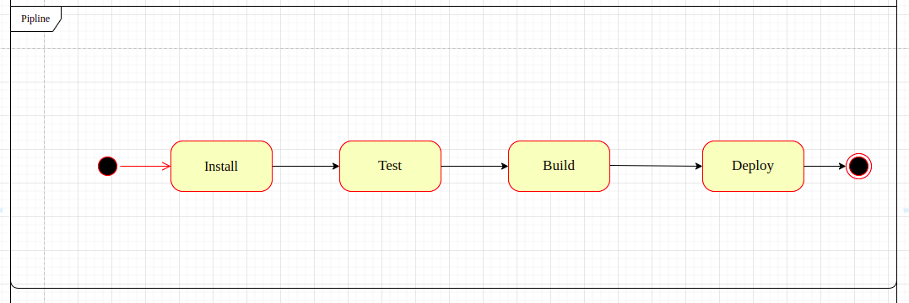
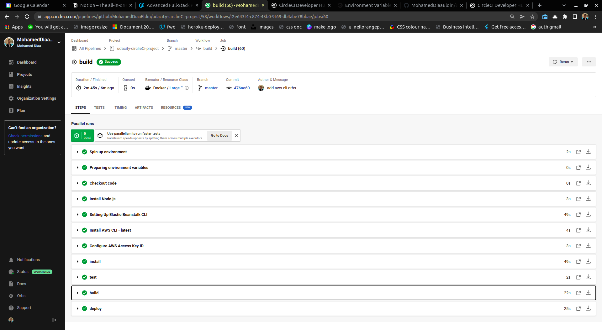

## Pipline Diagram

## pipline sequence 

1. Push to github 
2. Spin up environment
3. prepare environment variables 
4. checkout code 
5. install NodeJs
5. setting up elastic beans CLI
6. install AWS CLI
7. configure AWS Access key ID
8. install backend and frontend dependencies
9. frontend and API tests  
10. frontend and API build  
11. deploy frontend and backend

